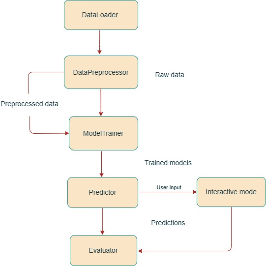

# 📦 Wind Power Forecasting Package
Team: PUSH & PRAY
repo: "https://github.com/DTUWindEducation/final-project-push-pray-1"

## Overview
This package provides a comprehensive solution for **short-term wind power forecasting**.  
It is designed to help predict the power output from wind energy production facilities one hour ahead of time, improving grid integration and operational planning.  
It includes modules for **data loading**, **feature engineering**, **model training**, **predictions**, and **evaluation**, all organized into a clean and modular structure for maintainability and scalability.  
The goal is to forecast **one hour ahead** power output using:
- **Random Forest Regressor**
- **Neural Network (MLPRegressor)**
- **Persistence Baseline Model**
---

## 🔧 Installation Instructions

**Requirements:**
- Python 3.8+
- updated pip 25.1+

---

Clone and install (e.g., using **Anaconda Prompt**):

```bash
cd "location of the cloned file"
pip install -e .
```


### ▶️ Running the Forecast

```bash
python examples/main.py
```

The script will:
1. Prompt location selection from `inputs/Location*.csv`
2. Preprocess and engineer features
3. Train models and compare their performance
4. Plot results and save them to `outputs/`
5. Optionally enable interactive prediction mode

---

## 🧱 High-Level Architecture

This diagram shows the **logical flow** of the system, not the file structure:

```


```

---

## 📁 Directory Overview

```
examples/
└── main.py                 # Main entry point

inputs/
├── Location1.csv           # Weather & power data
├── Location2.csv
├── Location3.csv
├── Location4.csv
└── diagram.jpg            # System diagram

outputs/
└── *.png                   # Saved plots

src/forecast/forecast/
├── A_data_loader.py        # Loads data
├── B_preprocessing.py      # Feature engineering
├── C_models.py             # Trains/tunes models
├── D_predictor.py          # Makes predictions
├── E_evaluation.py         # Evaluates and plots
└── A_user_input.py         # User CLI for interactive mode

tests/
└── test_*.py               # Unit tests for each module
```

---

## 🧪 Running Tests

Run all tests and code checks using:

```bash
pytest --cov=src tests/
pylint src/
```

Test coverage includes:
- Data loading
- Feature generation
- Model training and tuning
- Prediction logic
- Interactive input validation
- Evaluation and plotting

---

## 🧠 Module Summary

| Module           | Purpose |
|------------------|---------|
| `DataLoader`     | Loads and parses data from selected location |
| `DataPreprocessor` | Adds time, lag, interaction, and direction features |
| `ModelTrainer`   | Trains Random Forest and MLPRegressor with tuning |
| `Predictor`      | Performs model and persistence-based predictions |
| `Evaluator`      | Outputs MAE, RMSE, R² and saves comparison plots |
| `UserInput`      | Enables user-driven interactive predictions |

---

## 💡 Key Features

- Fully automated ML pipeline
- Interactive mode with custom weather parameters
- Model comparison plots with distinct visual styles
- Clean module separation for maintainability
- Comprehensive unit testing

---

## Peer Review
- Code was peer-reviewed by classmates during the Round Robins.
- External feedback was used to improve code modularity and documentation.
- Test coverage was implemented to ensure reliable results.

---

 If the reviewer follows the installation instructions, they will be able to **install** and **test** the package immediately.

